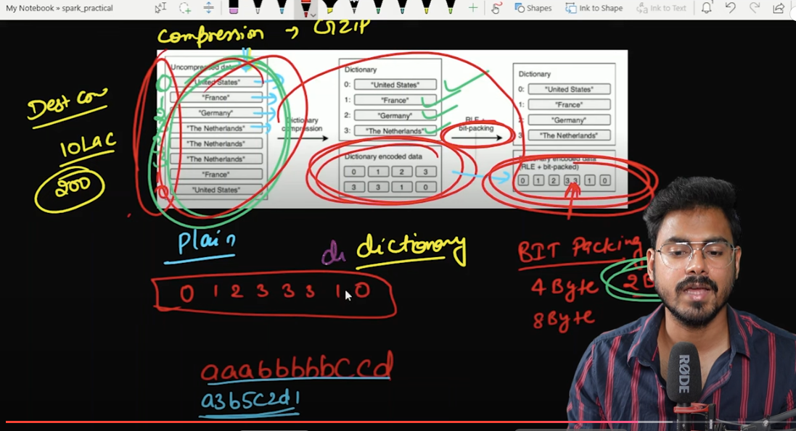
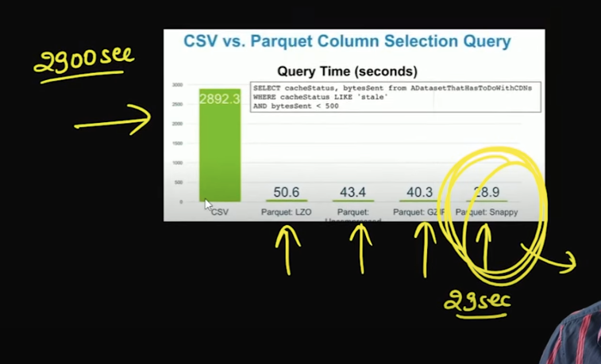
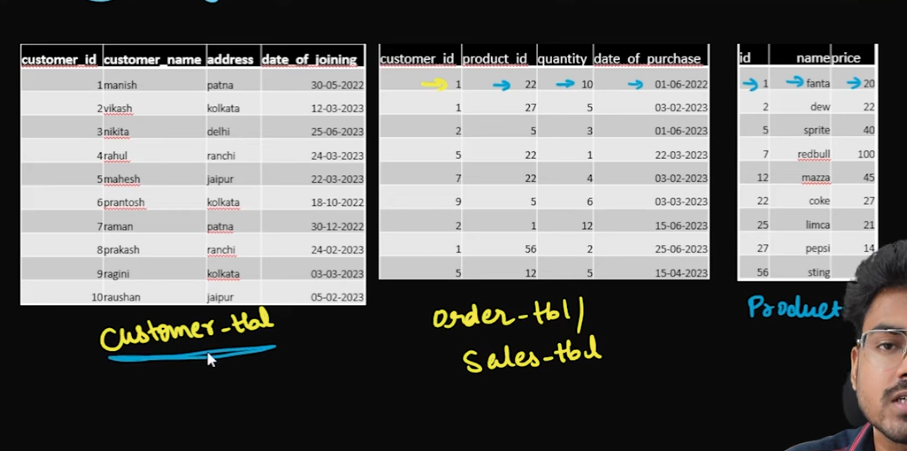
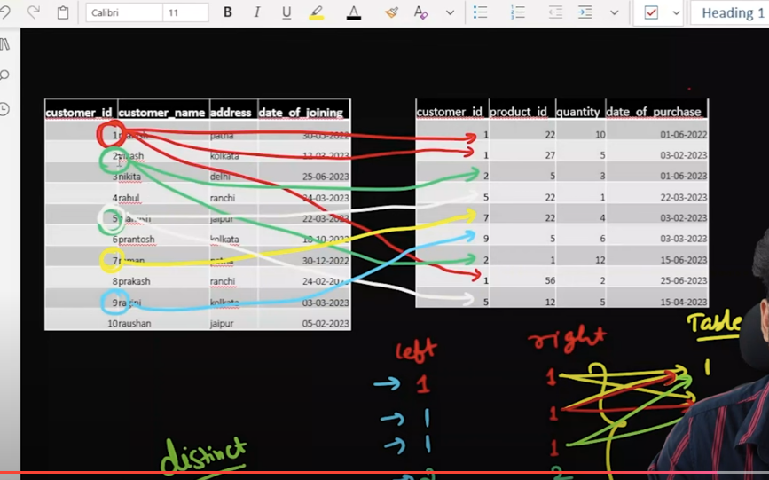

# 1. how to create databricks community edition account
https://www.youtube.com/watch?v=_j5LxhHuWFU&list=PLTsNSGeIpGnGjaMSYVlidqVWSjKWoBhbr&index=2

https://community.cloud.databricks.com/login.html

# 2. databricks community edition overview
https://www.youtube.com/watch?v=oNOcCZCgbMg&list=PLTsNSGeIpGnGjaMSYVlidqVWSjKWoBhbr&index=3

# 3. Read data in spark | Lec-3 | Read modes in spark
https://www.youtube.com/watch?v=aDCfzM7Cs7c&list=PLTsNSGeIpGnGjaMSYVlidqVWSjKWoBhbr&index=4

# 4. schema in spark | Lec-4
https://www.youtube.com/watch?v=U3sgM-ohLVE&list=PLTsNSGeIpGnGjaMSYVlidqVWSjKWoBhbr&index=5

https://spark.apache.org/docs/latest/sql-data-sources-csv.html

# 5. Handling corrupted records in spark | PySpark | Databricks
https://www.youtube.com/watch?v=wXGhaNGA7KA&list=PLTsNSGeIpGnGjaMSYVlidqVWSjKWoBhbr&index=6

https://spark.apache.org/docs/latest/sql-data-sources-csv.html

# 6. how to read json file in pyspark
https://www.youtube.com/watch?v=M0Kx205dxmM&list=PLTsNSGeIpGnGjaMSYVlidqVWSjKWoBhbr&index=7

File uploaded to /FileStore/tables/multi_line_correct.json
File uploaded to /FileStore/tables/file5.json
File uploaded to /FileStore/tables/multi_line_incorrect.json
File uploaded to /FileStore/tables/line_delimited_json_extrafield.json
File uploaded to /FileStore/tables/line_delimited_json.json
File uploaded to /FileStore/tables/corrupted_json.json

for multi_line_incorrect.json it will print only one record becaus not created list of dictionary

# 7. what is Apache Parquet file | Lec-7
https://www.youtube.com/watch?v=HyfGEbaZaX0&list=PLTsNSGeIpGnGjaMSYVlidqVWSjKWoBhbr&index=8

File uploaded to /FileStore/tables/part-r-00000-1a9822ba-b8fb-4d8e-844a-ea30d0801b9e.gz.parquet

# READ PARQUET FILE

from pyspark.sql import SparkSession

# Initialize Spark session
spark = SparkSession.builder \
    .appName("Read Parquet") \
    .master("local[*]") \
    .getOrCreate()

# Read the Parquet file into a DataFrame
df = spark.read.parquet('part-r-00000-1a9822ba-b8fb-4d8e-844a-ea30d0801b9e.gz.parquet')

# Show the contents of the DataFrame
df.show()

# to read parquet file first install 
pip install pandas==2.0.3
pip install parquet-tools==0.2.10

pip install pyarrow
parquet-tools show /home/zec/Downloads/Pyspark/PySpark_Practical/part-r-00000-1a9822ba-b8fb-4d8e-844a-ea30d0801b9e.gz.parquet

# to read metadata of file

parquet-tools inspect /home/zec/Downloads/Pyspark/PySpark_Practical/part-r-00000-1a9822ba-b8fb-4d8e-844a-ea30d0801b9e.gz.parquet

zec@zec-HP-EliteBook-840-G3:~$ parquet-tools inspect /home/zec/Downloads/Pyspark/PySpark_Practical/part-r-00000-1a9822ba-b8fb-4d8e-844a-ea30d0801b9e.gz.parquet

############ file meta data ############
created_by: parquet-mr (build 32c46643845ea8a705c35d4ec8fc654cc8ff816d)
num_columns: 3
num_rows: 255
num_row_groups: 1
format_version: 1.0
serialized_size: 658

############ Columns ############
DEST_COUNTRY_NAME
ORIGIN_COUNTRY_NAME
count

############ Column(DEST_COUNTRY_NAME) ############
name: DEST_COUNTRY_NAME
path: DEST_COUNTRY_NAME
max_definition_level: 1
max_repetition_level: 0
physical_type: BYTE_ARRAY
logical_type: String
converted_type (legacy): UTF8

############ Column(ORIGIN_COUNTRY_NAME) ############
name: ORIGIN_COUNTRY_NAME
path: ORIGIN_COUNTRY_NAME
max_definition_level: 1
max_repetition_level: 0
physical_type: BYTE_ARRAY
logical_type: String
converted_type (legacy): UTF8

############ Column(count) ############
name: count
path: count
max_definition_level: 1
max_repetition_level: 0
physical_type: INT64
logical_type: None
converted_type (legacy): NONE

# to print metadata information about parquet file

import pyarrow as pa
import pyarrow.parquet as pq

parquet_file = pq.ParquetFile(r'part-r-00000-1a9822ba-b8fb-4d8e-844a-ea30d0801b9e.gz.parquet')

print(parquet_file.metadata)
print(parquet_file.metadata.row_group(0)) 
print(parquet_file.metadata.row_group(0).column(0))
print(parquet_file.metadata.row_group(0).column(0).statistics) 

# 8. How to write dataframe to disk in spark 
https://www.youtube.com/watch?v=a-YGzAZEt04&list=PLTsNSGeIpGnGjaMSYVlidqVWSjKWoBhbr&index=9

/FileStore/tables/employee_write_data.csv

df = spark.read.csv('/FileStore/tables/employee_write_data.csv')
df.show()

df.write.format("csv")\
    .option("header",True)\
    .option("mode","overwrite")\
    .option('path','/FileStore/tables/csv_write')\
    .save()

dbutils.fs.ls('/FileStore/tables/csv_write')

# repartition

df.repartition(3).write.format("csv")\
    .option("header",True)\
    .option("mode","overwrite")\
    .option('path','/FileStore/tables/csv_write_repartition')\
    .save()

dbutils.fs.ls('/FileStore/tables/csv_write_repartition')

# 9. Partitioning and bucketing in Spark
https://www.youtube.com/watch?v=bf7_ek6SqJs&list=PLTsNSGeIpGnGjaMSYVlidqVWSjKWoBhbr&index=10

# partition by

df.write.format("csv")\
    .option("header", True)\
    .option("mode", "overwrite")\
    .option('path', '/FileStore/tables/partition_by_address_gender')\
    .partitionBy("address","gender")\
    .save()

dbutils.fs.ls('/FileStore/tables/partition_by_address_gender')

# Bucket by - 3 bucket

#bucketBy -  we have 15 records so we gave 3 no. of partitions
df.write.format("csv")\
    .option("header", True)\
    .option("mode", "overwrite")\
    .option('path', '/FileStore/tables/bucket_by_id')\
    .bucketBy(3,"id")\
    .saveAsTable("bucket_by_id_table") 

# 10. how to create dataframe in spark
https://www.youtube.com/watch?v=bRjxZmv0vGw&list=PLTsNSGeIpGnGjaMSYVlidqVWSjKWoBhbr&index=11

my_data = [(1,1),
        (2,1),
        (3,4),
        (4,2),
        (5,5),
        (6,8),
        (7,9)]

my_schema = ['id','num']

df = spark.createDataFrame(data=my_data, schema=my_schema)

df.show()

# 11. dataframe transformations in spark
https://www.youtube.com/watch?v=qhiWt5ni7yY&list=PLTsNSGeIpGnGjaMSYVlidqVWSjKWoBhbr&index=12

# to see only columns
df.columns

#dataframe

df = spark.read.option('inferSchema',True)\
            .option("header",True)
            .csv("filepath)

# manual schema
schema = StructType([ 
... StructField("firstname",StringType(),True),
... StructField("middlename",StringType(),True),
... StructField("lastname",StringType(),True),
... StructField("id", IntegerType(), True),
... StructField("gender", StringType(), True)])

employee_data1.select("id + 5").show()

# error due to datatype

AnalysisException: [UNRESOLVED_COLUMN.WITH_SUGGESTION] A column or function parameter with name `id + 5` cannot be resolved. Did you mean one of the following? [`id`, `address`, `age`, `name`, `nominee`].;
'Project ['id + 5]

# 12. dataframe transformations in spark
https://www.youtube.com/watch?v=PythD66exVM&list=PLTsNSGeIpGnGjaMSYVlidqVWSjKWoBhbr&index=13

- Alias 
- where/filter
- Literal
- Adding Column
- Renaming Column
- casting data type
- Removing columns

# 13.union vs unionAll | Lec-13 | spark interview questions
https://www.youtube.com/watch?v=4TAqpta7oJw&list=PLTsNSGeIpGnGjaMSYVlidqVWSjKWoBhbr&index=14

if we are working with spark datframe then union and unionAll both are same

if union and unionAll we are using in sql or spark sql then it union will give only distinct records

# 14. if else in pyspark | when otherwise | case when | Lec-14 
https://www.youtube.com/watch?v=jJR8pARSRTA&list=PLTsNSGeIpGnGjaMSYVlidqVWSjKWoBhbr&index=15

# 15. Unique & sorted records | Lec-15 | spark interview questions
https://www.youtube.com/watch?v=f8XslitrpqE&list=PLTsNSGeIpGnGjaMSYVlidqVWSjKWoBhbr&index=16

# leetcode question - https://leetcode.com/problems/find-customer-referee/description/?envType=study-plan-v2&envId=top-sql-50

Table: Customer

+-------------+---------+
| Column Name | Type    |
+-------------+---------+
| id          | int     |
| name        | varchar |
| referee_id  | int     |
+-------------+---------+
In SQL, id is the primary key column for this table.
Each row of this table indicates the id of a customer, their name, and the id of the customer who referred them.
 

Find the names of the customer that are not referred by the customer with id = 2.

Return the result table in any order.

The result format is in the following example.

 

Example 1:

Input: 
Customer table:
+----+------+------------+
| id | name | referee_id |
+----+------+------------+
| 1  | Will | null       |
| 2  | Jane | null       |
| 3  | Alex | 2          |
| 4  | Bill | null       |
| 5  | Zack | 1          |
| 6  | Mark | 2          |
+----+------+------------+
Output: 
+------+
| name |
+------+
| Will |
| Jane |
| Bill |
| Zack |
+------+

# 16. aggregate function | sum,min,max,avg etc | Lec-16 | spark interview questions
https://www.youtube.com/watch?v=FtsAOb4B-iY&list=PLTsNSGeIpGnGjaMSYVlidqVWSjKWoBhbr&index=17

# 17. group By in spark | Lec-17 | spark interview questions
https://www.youtube.com/watch?v=N8eK-maHqVE&list=PLTsNSGeIpGnGjaMSYVlidqVWSjKWoBhbr&index=18

# 18. join in pyspark | Lec-18 | spark interview questions
https://www.youtube.com/watch?v=BFFOtVX0FXE&list=PLTsNSGeIpGnGjaMSYVlidqVWSjKWoBhbr&index=19

# 19. join in pyspark | Lec-19 | spark interview questions
https://www.youtube.com/watch?v=1gm2AdfzsBQ&list=PLTsNSGeIpGnGjaMSYVlidqVWSjKWoBhbr&index=20

inner
outer
left
right

left_semi - # record from left table only which are matching from right table
ex- customer_df.join(sales_df,customer_df.customer_id == sales_df.customer_id,"left_semi").show()

left_anti - # record from left table only which are not matching from right table
ex - customer_df.join(sales_df,customer_df.customer_id == sales_df.customer_id,"left_anti").show() 
ex -  customer who never purchased a product

crossJoin

https://leetcode.com/problems/combine-two-tables/

Table: Person

+-------------+---------+
| Column Name | Type    |
+-------------+---------+
| personId    | int     |
| lastName    | varchar |
| firstName   | varchar |
+-------------+---------+
personId is the primary key (column with unique values) for this table.
This table contains information about the ID of some persons and their first and last names.
 

Table: Address

+-------------+---------+
| Column Name | Type    |
+-------------+---------+
| addressId   | int     |
| personId    | int     |
| city        | varchar |
| state       | varchar |
+-------------+---------+
addressId is the primary key (column with unique values) for this table.
Each row of this table contains information about the city and state of one person with ID = PersonId.
 

Write a solution to report the first name, last name, city, and state of each person in the Person table. If the address of a personId is not present in the Address table, report null instead.

Return the result table in any order.

The result format is in the following example.

 

Example 1:

Input: 
Person table:
+----------+----------+-----------+
| personId | lastName | firstName |
+----------+----------+-----------+
| 1        | Wang     | Allen     |
| 2        | Alice    | Bob       |
+----------+----------+-----------+
Address table:
+-----------+----------+---------------+------------+
| addressId | personId | city          | state      |
+-----------+----------+---------------+------------+
| 1         | 2        | New York City | New York   |
| 2         | 3        | Leetcode      | California |
+-----------+----------+---------------+------------+
Output: 
+-----------+----------+---------------+----------+
| firstName | lastName | city          | state    |
+-----------+----------+---------------+----------+
| Allen     | Wang     | Null          | Null     |
| Bob       | Alice    | New York City | New York |
+-----------+----------+---------------+----------+
Explanation: 
There is no address in the address table for the personId = 1 so we return null in their city and state.
addressId = 1 contains information about the address of personId = 2.

# 20. window function in pyspark | rank and dense_rank | Lec-20
https://www.youtube.com/watch?v=NfldkGW-xUQ&list=PLTsNSGeIpGnGjaMSYVlidqVWSjKWoBhbr&index=21

from pyspark.sql.window import Window

window = Window.partitionBy("dept")

emp_df.withColumn("total_salary",sum(col('salary')).over(window))\
    .show(truncate=False)

--------------------------------------

from pyspark.sql.window import Window

window = Window.partitionBy("dept").orderBy("salary")

emp_df.withColumn('row_number',row_number().over(window))\
    .show(truncate=False)

group by only gives required columns
windows gives all columns also 

if ask for top two performer then you have to ask if two people have same value
------------------------------------------------------------

# top two performer in each department

from pyspark.sql.window import Window

window = Window.partitionBy("dept").orderBy(desc("salary"))

emp_df.withColumn("row_number",row_number().over(window))\
    .withColumn("rank",rank().over(window))\
    .withColumn("dense_rank",dense_rank().over(window))\
    .filter(col("dense_rank") <= 2)\
    .show(truncate=False)

# 21. lead and lag in spark | window function in pyspark | Lec-21
https://www.youtube.com/watch?v=RHEHewxA4Gg&list=PLTsNSGeIpGnGjaMSYVlidqVWSjKWoBhbr&index=22

#lead - three argument - column , no. of next records , if no record then null
#lag - three argument - column , no. of previus records , if no record then null

# 22. rows between in spark | range between in spark | window function in pyspark | Lec-22
https://www.youtube.com/watch?v=FNrOnHNzoJI&list=PLTsNSGeIpGnGjaMSYVlidqVWSjKWoBhbr&index=23

# 23. flatten nested json in spark | Lec-20 | most requested video
https://www.youtube.com/watch?v=sTk1hflzPYc&list=PLTsNSGeIpGnGjaMSYVlidqVWSjKWoBhbr&index=24

# 24. scd2 in spark | Lec-24
https://www.youtube.com/watch?v=res3ICaMQTM&list=PLTsNSGeIpGnGjaMSYVlidqVWSjKWoBhbr&index=25
