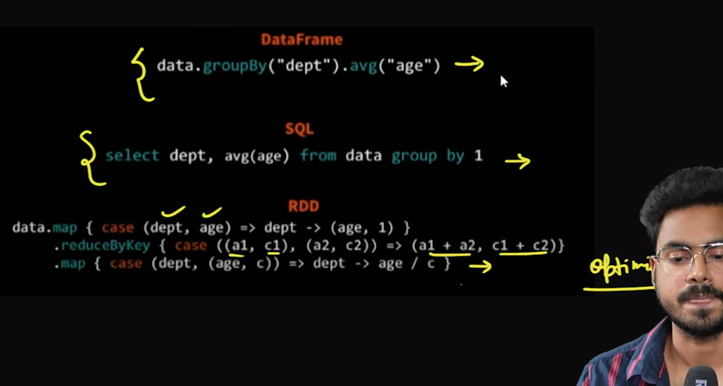
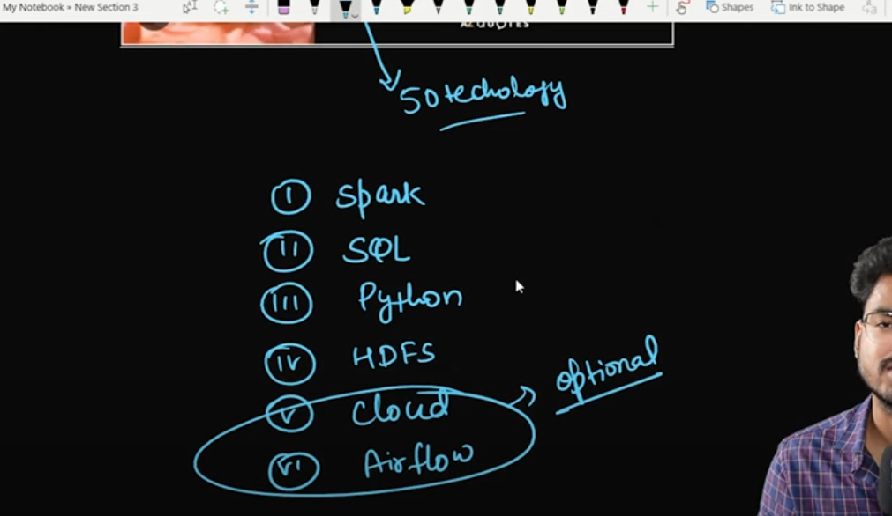

Apache Spark Core—Deep Dive—Proper Optimization Daniel Tomes Databricks - https://www.youtube.com/watch?v=daXEp4HmS-E

GIT for data- https://github.com/databricks/Spark-The-Definitive-Guide/tree/master/data/flight-data/csv

Spark fundamental (Theory)

# 1. course introduction
https://www.youtube.com/watch?v=FNMoeE849Yw&list=PLTsNSGeIpGnGkpfKMf7ilFmzfx6AjMKyT&index=1

# 2. spark overview | lec-1
https://www.youtube.com/watch?v=xW_GNBDW568&list=PLTsNSGeIpGnGkpfKMf7ilFmzfx6AjMKyT&index=2

# 3. Why Apache spark | Lec-2
https://www.youtube.com/watch?v=N3vk5i_Hh78&list=PLTsNSGeIpGnGkpfKMf7ilFmzfx6AjMKyT&index=3

# 4.Hadoop vs Spark | Lec-3 | In depth explanation
https://www.youtube.com/watch?v=mpMvOPhNtjA&list=PLTsNSGeIpGnGkpfKMf7ilFmzfx6AjMKyT&index=4

# 5. spark ecosystem | Lec - 4
https://www.youtube.com/watch?v=7x9GXt6-AxU&list=PLTsNSGeIpGnGkpfKMf7ilFmzfx6AjMKyT&index=5

# 6. spark architecture | Lec-5
https://www.youtube.com/watch?v=xJVonk4yxJY&list=PLTsNSGeIpGnGkpfKMf7ilFmzfx6AjMKyT&index=6

# 7. transformation and action in spark
https://www.youtube.com/watch?v=ce-F5lyFeyk&list=PLTsNSGeIpGnGkpfKMf7ilFmzfx6AjMKyT&index=7

# 8. DAG and Lazy Evaluation in spark
https://www.youtube.com/watch?v=JHm7BkRp3T8&list=PLTsNSGeIpGnGkpfKMf7ilFmzfx6AjMKyT&index=8

#every action will have one job and every job will have one DAG

df = spark.read.format("csv").option("header","true").option("inferSchema","true").load("dbfs:/FileStore/demo_folder/flight_data.csv") #action - read(), inferSchema

df_repartition = df.repartition(3) #wide transformation

us_df = df.filter(df.DEST_COUNTRY_NAME == 'United States') #Narrow

us_india_df = us_df.filter((df.ORIGIN_COUNTRY_NAME == 'India') | (df.ORIGIN_COUNTRY_NAME == 'Singapore')) #transformation

total_flight_df = us_india_df.groupBy('DEST_COUNTRY_NAME').sum('count') # wide transformation

total_flight_df.show() #action

#every action will have one job and every job will have one DAG

# 9. spark sql engine in spark | Lec-8
https://www.youtube.com/watch?v=VDZ7erjooU0&list=PLTsNSGeIpGnGkpfKMf7ilFmzfx6AjMKyT&index=9

df = spark.read.format("csv").option("header","true").option("inferSchema","true").load("dbfs:/FileStore/demo_folder/flight_data.csv") #action - read(), inferSchema

df.select('Name').show() #column is not present so it will give AnalysisException error

AnalysisException: [UNRESOLVED_COLUMN.WITH_SUGGESTION] A column or function parameter with name `Name` cannot be resolved. Did you mean one of the following? [`count`, `DEST_COUNTRY_NAME`, `ORIGIN_COUNTRY_NAME`].;
'Project ['Name]

# 10. rdd in spark
https://www.youtube.com/watch?v=vWSQIIiS8sg&list=PLTsNSGeIpGnGkpfKMf7ilFmzfx6AjMKyT&index=10

# 11. spark session vs spark context | Lec-10
https://www.youtube.com/watch?v=o4EfpnTGzvE&list=PLTsNSGeIpGnGkpfKMf7ilFmzfx6AjMKyT&index=11

In Spark, you can configure the driver and executor resources (such as memory and the number of cores) using Spark configurations. These configurations control how Spark allocates resources to the driver and executor processes when running a job.

1. Driver Configuration
The driver is the process that coordinates the execution of your Spark application. You can configure its resources as follows:

Driver memory: Set how much memory to allocate to the driver.
Driver cores: Set how many cores the driver should use (available in cluster mode).

spark = SparkSession.builder \
    .appName("Testing") \
    .master("local[5]") \
    .config("spark.driver.memory", "12G") \  # Set driver memory
    .config("spark.driver.cores", "4") \     # Set driver cores (only in cluster mode)
    .getOrCreate()

2. Executor Configuration
Executors are the distributed worker processes that run tasks in parallel. You can configure their resources using the following settings:

Executor memory: Set the memory allocated to each executor.
Executor cores: Set how many cores each executor will use.
Number of executors: Set the total number of executors to be launched.

spark = SparkSession.builder \
    .appName("Testing") \
    .master("local[5]") \
    .config("spark.executor.memory", "4G") \   # Set executor memory
    .config("spark.executor.cores", "2") \     # Set number of cores per executor
    .config("spark.executor.instances", "10") \# Set the number of executors
    .getOrCreate()

Key Configuration Parameters:
spark.driver.memory: Memory allocated to the driver process (e.g., "12G").
spark.driver.cores: Number of CPU cores allocated to the driver (only available in cluster mode).
spark.executor.memory: Memory allocated to each executor (e.g., "4G").
spark.executor.cores: Number of CPU cores per executor (e.g., 2).
spark.executor.instances: Number of executors to launch (useful in cluster mode).
You can modify these parameters to suit your application’s needs based on the available resources and the workload.

# 12. Spark Job, Stages, Tasks
https://www.youtube.com/watch?v=wL42r3Fgfsk&list=PLTsNSGeIpGnGkpfKMf7ilFmzfx6AjMKyT&index=12

df = spark.read.format("csv").option("header","true").option("inferSchema","true").load("dbfs:/FileStore/demo_folder/flight_data.csv") 

df_repartition = df.repartition(3) #wide transformation

us_df = df.filter(df.DEST_COUNTRY_NAME == 'United States') #Narrow

us_india_df = us_df.filter((df.ORIGIN_COUNTRY_NAME == 'India') | (df.ORIGIN_COUNTRY_NAME == 'Singapore')) #transformation

total_flight_df = us_india_df.groupBy('DEST_COUNTRY_NAME').sum('count') # wide transformation

total_flight_df.show() #action

# 13. we need to talk !!!
https://www.youtube.com/watch?v=zf5xA-FRROY&list=PLTsNSGeIpGnGkpfKMf7ilFmzfx6AjMKyT&index=13

# 14. repartition vs coalesce
https://www.youtube.com/watch?v=VJCphHzB4Qk&list=PLTsNSGeIpGnGkpfKMf7ilFmzfx6AjMKyT&index=14

from pyspark.sql.functions import *
flight_df = df.repartition(4)
flight_df.withColumn('partitionId',spark_partition_id()).groupBy('partitionId').count().show()

flight_df1 = df.repartition(32,'DEPARTMENT_NAME') # no. of partition of column DEPARTMENT_NAME

flight_df2 = df.coalesce(8,'DEPARTMENT_NAME')
flight_df2.withColumn('partitionId',spark_partition_id()).groupBy('partitionId').count().show()

# 15. Spark Join | Sort vs Shuffle | Spark Interview Question
https://www.youtube.com/watch?v=ZkJowO83MZ0&list=PLTsNSGeIpGnGkpfKMf7ilFmzfx6AjMKyT&index=15

# 16. Broadcast Join in spark | Spark Interview Question
https://www.youtube.com/watch?v=mV-6xM8dJYM&list=PLTsNSGeIpGnGkpfKMf7ilFmzfx6AjMKyT&index=16

# 17. driver out of memory spark | spark memory management
https://www.youtube.com/watch?v=2Eb9mE7pfgs&list=PLTsNSGeIpGnGkpfKMf7ilFmzfx6AjMKyT&index=17

pyspark --master local

df = spark.range(100000000)
df.show() #gives result ,it give only few result
df.collect()  #OOM becasue it read all the executors data

# 18. executor out of memory spark | spark memory management 
https://www.youtube.com/watch?v=b2hO1oJf9nA&list=PLTsNSGeIpGnGkpfKMf7ilFmzfx6AjMKyT&index=18

# 19. Spark Submit 
https://www.youtube.com/watch?v=EEq9JxGGEZE&list=PLTsNSGeIpGnGkpfKMf7ilFmzfx6AjMKyT&index=19

/mnt/spark - bin folder then spark submit command

https://spark.apache.org/docs/latest/configuration.html

# Run application locally on 8 cores
./bin/spark-submit \
  --class org.apache.spark.examples.SparkPi \
  --master local[8] \
  /path/to/examples.jar \
  100

# Run on a Spark standalone cluster in client deploy mode
./bin/spark-submit \
  --class org.apache.spark.examples.SparkPi \
  --master spark://207.184.161.138:7077 \
  --executor-memory 20G \
  --total-executor-cores 100 \
  /path/to/examples.jar \
  1000

# Run on a Spark standalone cluster in cluster deploy mode with supervise
./bin/spark-submit \
  --class org.apache.spark.examples.SparkPi \
  --master spark://207.184.161.138:7077 \
  --deploy-mode cluster \
  --supervise \
  --executor-memory 20G \
  --total-executor-cores 100 \
  /path/to/examples.jar \
  1000

# Run on a YARN cluster in cluster deploy mode
export HADOOP_CONF_DIR=XXX
./bin/spark-submit \
  --class org.apache.spark.examples.SparkPi \
  --master yarn \
  --deploy-mode cluster \
  --executor-memory 20G \
  --num-executors 50 \
  /path/to/examples.jar \
  1000

# Run a Python application on a Spark standalone cluster
./bin/spark-submit \
  --master spark://207.184.161.138:7077 \
  examples/src/main/python/pi.py \
  1000

# Run on a Mesos cluster in cluster deploy mode with supervise
./bin/spark-submit \
  --class org.apache.spark.examples.SparkPi \
  --master mesos://207.184.161.138:7077 \
  --deploy-mode cluster \
  --supervise \
  --executor-memory 20G \
  --total-executor-cores 100 \
  http://path/to/examples.jar \
  1000

# Run on a Kubernetes cluster in cluster deploy mode
./bin/spark-submit \
  --class org.apache.spark.examples.SparkPi \
  --master k8s://xx.yy.zz.ww:443 \
  --deploy-mode cluster \
  --executor-memory 20G \
  --num-executors 50 \
  http://path/to/examples.jar \
  1000

# command to run on production level (client mode)

PTTHONPATH=C:\Users\nikita\Desktop\youtube_ideas\youtube_de_projects1

spark-submit --master local[2] --driver-memory 1g --executor-memory 1g --num-executors 2 --executor-cores 2 --jars C:\my_sql_jar\mysql-connector-java-8.0.26.jar C:\Users\nikita\Desktop\youtube_ideas\youtube_de_project1\src\main\transformations\jobs\main.py mainsh_cmd_test

C:\Users\nikita\Desktop\youtube_ideas\youtube_de_project1\resources\log_files.log

# 20. deployment mode in spark | edge node in spark 
https://www.youtube.com/watch?v=C94-000jh6E&list=PLTsNSGeIpGnGkpfKMf7ilFmzfx6AjMKyT&index=20

# 21. AQE in spark
https://www.youtube.com/watch?v=-zgdmj_2_gU&list=PLTsNSGeIpGnGkpfKMf7ilFmzfx6AjMKyT&index=21

AQE - https://spark.apache.org/docs/latest/sql-performance-tuning.html

# 22. cache and persist in spark 
https://www.youtube.com/watch?v=Pw1vn82wEBE&list=PLTsNSGeIpGnGkpfKMf7ilFmzfx6AjMKyT&index=22

# 23. dynamic resource allocation in spark
https://www.youtube.com/watch?v=_PA86Npk1ck&list=PLTsNSGeIpGnGkpfKMf7ilFmzfx6AjMKyT&index=23

https://spark.apache.org/docs/latest/api/python/reference/pyspark.sql/api/pyspark.sql.DataFrame.persist.html

https://spark.apache.org/docs/latest/rdd-programming-guide.html

# 24. dynamic partition pruning in spark 
https://www.youtube.com/watch?v=H64-pPRbptE&list=PLTsNSGeIpGnGkpfKMf7ilFmzfx6AjMKyT&index=24

# 25. salting in spark | how to handle data skew issue
https://www.youtube.com/watch?v=gfr81htVMkQ&list=PLTsNSGeIpGnGkpfKMf7ilFmzfx6AjMKyT&index=25

id_value = [1]*5 + [2]*3 + [3]*2

comment join at line number 198

table2.show(100)

# 26.data engineer interview questions
https://www.youtube.com/watch?v=diHUuPIaMpI&list=PLTsNSGeIpGnGkpfKMf7ilFmzfx6AjMKyT&index=26

# Project details for resume :- 

.Successfully led a data engineering project in a retail environment using technologies such as Apache Spark, Python, SQL, and Amazon S3 to optimize data processing.

.Implemented structured data models, including dimension and fact tables, to provide valuable context for point-of-sale data analysis.

Designed and executed an incentive program based on sales performance, enhancing motivation among sales teams by rewarding top performers.

Managed extensive daily data volumes of approximately 100GB, demonstrating the ability to handle large-scale data pipelines.

Employed Spark optimization techniques like caching and broadcast joins to improve data processing speed and efficiency.

Utilized Azure CI/CD pipelines for code deployment, and orchestrated workflows using Airflow and CRON jobs.

Detailed writeup to explain more during interview:-

As a Data Engineer on a project for a prominent offline grocery and kitchen supplies retailer, I applied my expertise in data engineering to drive critical improvements in their data processing and analysis operations.

The project primarily focused on processing and analyzing point-of-sale data, which was structured into dimension and fact tables to provide meaningful context for sales analysis. To further enhance employee motivation and performance, we designed and implemented an incentive program that rewarded salespeople with the highest sales volumes in each store.

Handling a substantial daily data volume of approximately 100GB, we leveraged Apache Spark and applied optimization techniques like data caching and broadcast joins to significantly accelerate data processing. This not only improved the speed of our data pipelines but also increased the efficiency of our data analysis.

We seamlessly integrated the code deployment process into the Azure CI/CD pipeline. As part of workflow automation, we orchestrated task scheduling using Airflow and CRON jobs.

One of the project's major achievements was the implementation of a customer engagement strategy that identified infrequent buyers and provided incentives in the form of coupons. This initiative not only boosted customer retention but also had a positive impact on the overall business growth.